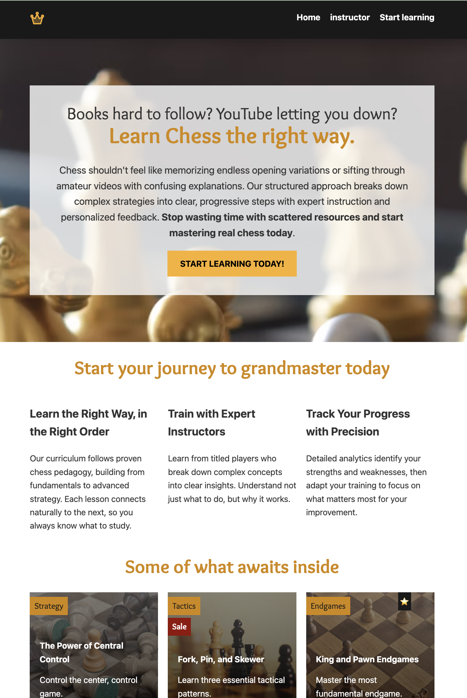

# ♟️ Chess Learning Platform

A responsive multi-page website for a fictional online chess academy.

The goal of this project was to strengthen my HTML and CSS skills by building a realistic website from scratch. It focuses on responsive layouts, modern CSS techniques, reusable components, and clean semantic markup.

---

## 📸 Preview




---

## 🚀 Live Demo

👉 **GitHub Pages:** *Add your GitHub Pages URL here*

---

## ✨ Features

- Responsive design for desktop and mobile
- Multi-page website
- Instructor profile pages
- Interactive instructor gallery
- CSS Grid layouts
- Flexbox layouts
- CSS custom properties (variables)
- SVG sprite icons
- Hover animations and transitions
- Responsive typography
- Semantic HTML5
- Accessible image descriptions

---

## 📄 Pages

### Home

- Hero section
- Feature overview
- Course showcase
- Call-to-action footer

### Instructors

- Featured instructor profile
- Instructor gallery
- Individual instructor pages
- Responsive instructor layout

---

## 🛠️ Built With

- HTML5
- CSS3
- CSS Grid
- Flexbox
- CSS Variables
- Media Queries
- SVG Sprites
- Custom Fonts

---

## 📚 What I Practiced

This project gave me hands-on experience with:

- Building responsive layouts
- CSS Grid template areas
- Flexbox alignment
- Image overlays
- Absolute positioning
- `aspect-ratio`
- `object-fit`
- CSS transitions
- Reusable CSS components
- Semantic HTML structure
- Organizing a larger CSS file

---

## 📱 Responsive Design

The layout automatically adapts to different screen sizes.

### Desktop

- Three-column instructor gallery

### Mobile

- Single-column layouts
- Simplified instructor profile
- Responsive typography
- Optimized spacing

---

## 📂 Project Structure

```text
.
├── css/
│   └── style.css
├── fonts/
├── img/
│   ├── svg-sprite.svg
│   ├── crown.svg
│   ├── chess-bg.jpg
│   └── ...
├── index.html
├── instructor.html
├── instructor_viktor_kozlov.html
└── README.md
```

---

## 🎯 Project Scope

The primary goal of this project was to practice responsive layouts and modern CSS techniques rather than build a fully functional application.

For that reason, only two instructor cards currently link to dedicated profile pages. They demonstrate the intended page structure and navigation.

In a future iteration, these pages would be generated dynamically using JavaScript and data from a backend or database instead of separate static HTML files.

---

## 🔮 Future Improvements

- Generate instructor pages dynamically with JavaScript
- Store instructor data in a database
- Fetch instructor information from an API
- Add course filtering
- Add search functionality
- Improve accessibility
- Add dark mode

---

## 💡 What I Learned

One of the biggest lessons from this project was learning when to use CSS Grid versus Flexbox and how they work together.

I also became much more comfortable working with:

- positioning elements
- responsive images
- reusable layouts
- CSS architecture
- debugging layout issues
- building interfaces without relying on frameworks

---

## 👩‍💻 Author

**Anastasiia Nerez**

GitHub: https://github.com/nerezasn

LinkedIn: https://www.linkedin.com/in/anastasiia-nerez-86340b155/

---

⭐ If you enjoyed this project or found it useful, feel free to star the repository!
